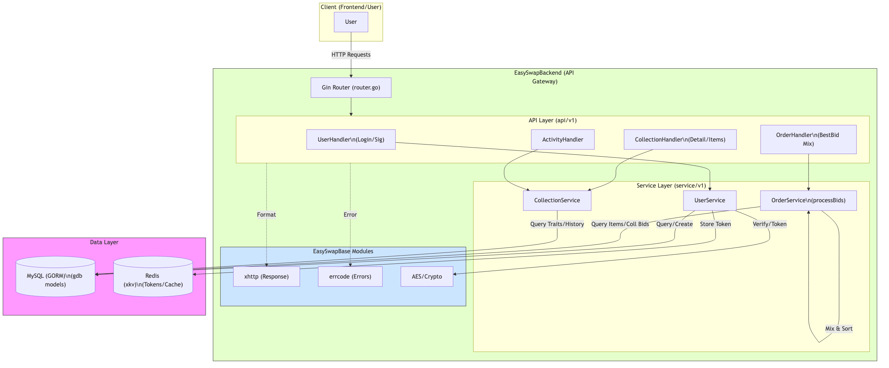

# EasySwapBackend 功能模块与核心流程分析

`EasySwapBackend` 是项目的 API 网关服务，负责为前端提供数据接口，处理用户登录、签名验证、以及复杂的 NFT 数据查询聚合。

## 1. 核心功能模块

基于 `api/v1` 和 `service/v1` 的目录结构，后端主要包含以下功能模块：

| 模块 | 路由前缀 | 功能描述 | 核心方法 (Service) |
| :--- | :--- | :--- | :--- |
| **用户认证 (User)** | `/user` | 处理 Web3 登录、JWT Token 生成、签名验证。 | `UserLogin`, `GetUserLoginMsg` |
| **集合 (Collections)** | `/collections` | 查询 NFT 集合详情、排名、NFT Item 列表、属性 (Traits)、历史销量等。 | `GetCollectionDetail`, `GetCollectionItems` |
| **出价 (Orders)** | `/bid-orders` | 聚合查询 NFT 的最佳出价 (Best Bid)，支持单品出价和集合出价的混合计算。 | `GetOrderInfos`, `processBids` |
| **资产 (Portfolio)** | `/portfolio` | 查询用户持有的 NFT 资产、上架列表 (Listings)、出价列表 (Bids)。 | `GetUserCollectionList`, `GetUserListings` |
| **活动 (Activities)** | `/activities` | 查询跨链的交易活动日志 (Mint/Sale/Transfer)。 | `GetActivityList` |

---

## 2. 核心代码流程详解(附详细注释)

以下核心流程代码已在源文件中通过中文注释详细说明。

### 2.1 用户登录流程 (`service/v1/user.go`)

Web3 登录采用了经典的 **"获取随机数 -> 签名 -> 验证 -> 颁发 Token"** 流程。

1.  **获取消息**: `GetUserLoginMsg` 生成随机 UUID (Nonce) 并存入 Redis。
2.  **前端签名**: 用户使用私钥对消息签名。
3.  **验证登录**: `UserLogin` 接收签名，验证 Nonce 是否匹配，验证签名是否有效（需补充），若成功则颁发 Session Token。

### 2.2 最佳出价计算流程 (`service/v1/order.go: GetOrderInfos`)

这是 Backend 中业务逻辑最复杂的部分之一，需要混合计算 **Collection Offer** (集合出价) 和 **Item Offer** (单品出价)。

逻辑步骤：
1.  **查询单品出价**: 针对 Specific Token ID 的出价。
2.  **查询集合出价**: 针对整个 Collection (Any Token) 的出价。
3.  **撮合 (`processBids`)**:
    *   遍历目标 Token ID。
    *   若该 Token 有单品出价 > 集合出价，展示单品出价。
    *   否则展示当前最高的集合出价。
    *   逻辑类似 OpenSea，优先展示对卖家最有利（价格最高）的 Offer。

---

## 3. 功能复用与处理

Backend 并没有重新发明轮子，而是大量复用了 `EasySwapBase` 的能力：

| 功能点 | EasySwapBase 复用模块 | 实现方式 |
| :--- | :--- | :--- |
| **API 响应** | `xhttp` | 使用 `xhttp.OkJson` 和 `xhttp.Error` 统一封装 JSON 结构 (code, msg, data)。 |
| **错误处理** | `errcode` | 业务层返回 `errcode.NewCustomErr`，中间件自动捕获并转换 HTTP 状态码。 |
| **数据模型** | `stores/gdb` | 直接引用 `orderbookmodel` 下的 `User`, `Order` 等 GORM 结构体，无需重复定义 SQL Schema。 |
| **Redis** | `stores/xkv` | 使用封装好的 `KvStore` 进行 Token 存储和 API 缓存 (`middleware.CacheApi`)。 |

---

## 4. 架构流程图

## 5. 总结
`EasySwapBackend` 是一个典型的 **"读多写少"** 的 RESTful 服务：
1.  **聚合查询**: 核心价值在于将数据库中的原子数据（Order, Activity）聚合成前端易用的视图（Ranking, Portfolio）。
2.  **轻量级**: 复杂的写操作（如订单撮合、状态流转）主要由 `EasySwapSync` 处理，Backend 主要负责验签和落库，保持了逻辑的轻量和响应的高速。
