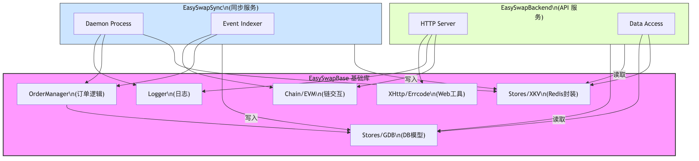

# EasySwapBase 功能模块与项目复用分析

`EasySwapBase` 是整个 EasySwap 生态系统的核心基础设施库，提供了各个微服务（Sync, Backend）共用的底层逻辑、数据模型和工具链。以下是其核心功能模块在各项目中的应用分析。

## 1. 核心功能模块概览

| 模块路径 | 功能描述 | 主要用途 |
| :--- | :--- | :--- |
| **`ordermanager`** | **订单管理核心** | 包含订单生命周期管理、过期检查、地板价计算、上架统计等核心业务逻辑。 |
| **`stores/gdb`** | **数据库模型 (ORM)** | 定义了 MySQL 数据库的表结构 (Schema)，包括 `order`, `activity`, `collection` 等 GORM 模型。 |
| **`stores/xkv`** | **缓存存储 (Redis)** | 封装了 Redis 操作，用于实现队列、缓存、分布式锁等。 |
| **`chain/chainclient`** | **链客户端** | 封装了 EVM RPC 客户端，用于查询区块高度、调用合约、解析日志。 |
| **`logger/xzap`** | **日志系统** | 基于 Uber Zap 的日志封装，提供统一的日志格式和上下文追踪。 |
| **`xhttp`** | **HTTP 工具** | 提供 HTTP 响应封装 (Success/Error)、请求解析等，主要用于 Backend API。 |
| **`errcode`** | **错误码定义** | 定义了系统通用的业务错误码 (Code) 和错误信息 (Message)。 |
| **`evm`** | **EVM 工具** | 包含 ERC20/721 标准接口 (`erc`)、EIP 签名验证 (`eip`) 等工具。 |

---

## 2. 各项目功能复用分析

### 2.1 EasySwapSync (数据同步服务)
Sync 服务主要负责"写"操作和"后台计算"，重度依赖 Base 的逻辑处理模块。

*   **`ordermanager` (核心依赖)**: 直接使用 `OrderManager` 进行订单的入队、过期检查、地板价更新。Sync 服务本质上是 `ordermanager` 的驱动器。
*   **`chain/chainclient`**: 用于监听区块链事件 (`FilterLogs`)。
*   **`stores/gdb` & `stores/xkv`**: 读写数据库和 Redis 队列。
*   **`logger`**: 记录同步日志。

### 2.2 EasySwapBackend (API 后端服务)
Backend 服务主要负责"读"操作和"用户交互"，重度依赖 Base 的数据模型和 Web 工具。

*   **`stores/gdb` (核心依赖)**: 使用共享的 GORM 模型查询订单、集合、NFT 详情。
*   **`xhttp` & `errcode`**: 统一 API 的响应格式和错误处理。
*   **`evm`**: 用于验证用户签名 (Login/Order Signature) 和解析合约数据。
*   **`ordermanager`**: 虽然 Backend 主要是读，但也复用了 `ordermanager` 中的一些常量或辅助函数。
*   **`stores/xkv`**: 读取由 Sync 服务写入 Redis 的统计数据 (如 Listing Count, Floor Price Cache)。

---

## 3. 依赖关系流程图



## 4. 队列数据处理机制的开启与运行

`ordermanager` 中的队列处理机制并非自动运行，而是需要宿主程序（Host Application，即 `EasySwapSync`）显式调用启动。

### 4.1 开启流程
1.  **初始化**: 在 `EasySwapSync/service/service.go` 的 `New` 方法中，通过 `ordermanager.New(...)` 创建实例。
2.  **启动**: 在 `EasySwapSync` 启动时调用 `s.orderManager.Start()`。

### 4.2 核心处理协程
`Start()` 方法会通过 `threading.GoSafe` 启动以下 **4个核心协程 (Goroutines)** 并行处理数据：

| 协程/方法 | 功能描述 | 触发机制 |
| :--- | :--- | :--- |
| **`ListenNewListingLoop`** | **新挂单处理**<br>监听 Redis 队列，验证新订单有效性，分发至过期队列和价格队列。 | 轮询 Redis<br>`LPOP cache:es:orders:{chain}` |
| **`orderExpiryProcess`** | **过期时间轮**<br>每秒转动时间轮，检查并处理已过期的订单，更新 DB 状态。 | 时间轮 Ticker<br>(1秒/次) |
| **`floorPriceProcess`** | **地板价计算**<br>消费交易事件队列，维护内存最小堆，实时计算并更新地板价。 | 轮询 Redis<br>`LPOP cache:es:trade:events:{chain}` |
| **`listCountProcess`** | **统计更新**<br>定时统计指定集合的 Listing 数量并写入缓存。 | 信号通道 + 定时器<br>(Channel + 60s Ticker) |

### 4.3 代码调用链示例
```go
// EasySwapSync/service/service.go

func (s *Service) Start() error {
    // ...
    // 显式启动 OrderManager，从而开启上述4个处理协程
    s.orderManager.Start()
    return nil
}
```

## 5. 总结
`EasySwapBase` 扮演了 **"共享内核"** 的角色：
1.  **数据一致性**: Sync 和 API 使用同一套 `gdb` 模型，确保了数据库读写的一致性。
2.  **逻辑复用**: `ordermanager` 封装了复杂的订单状态机，避免了在不同项目中重复实现业务逻辑。
3.  **解耦**: 基础设施（Redis/Log/Http）的封装使得上层业务代码更加专注于业务本身，便于维护。
