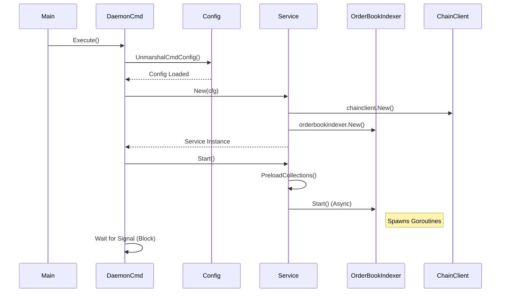
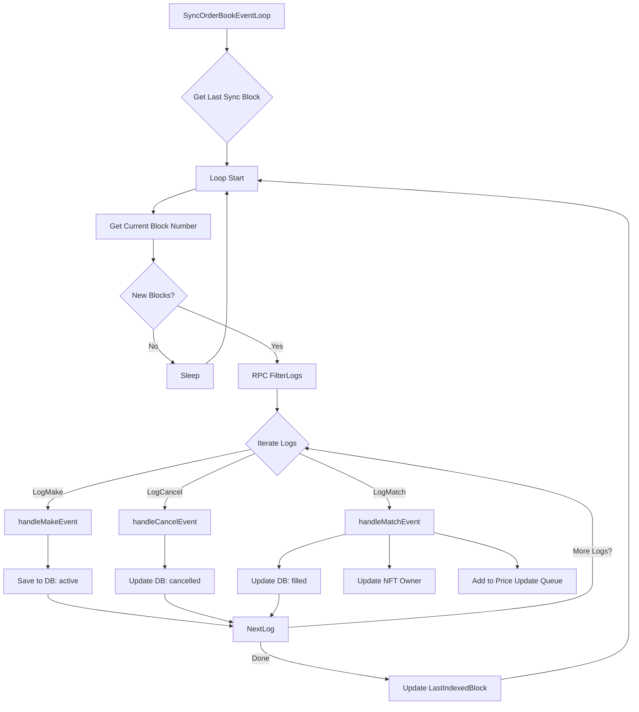

# EasySwapSync Daemon 流程分析文档

本文档详细解析了通过 `go run main.go daemon` 启动 EasySwapSync 同步服务后的完整执行流程，列出了关键方法的调用链，并提供了流程图解。

## 1. 启动流程概览 (Startup Overview)

程序的入口是 `main.go`，它将控制权移交给 `cobra` 命令行框架 (`cmd` 包)，最终执行 `daemon` 命令的业务逻辑。

### 调用链 (Call Chain)
1.  **`main.main()`** (`EasySwapSync/main.go`)
    *   程序入口。
    *   调用 `cmd.Execute()`。
2.  **`cmd.Execute()`** -> **`cmd.DaemonCmd.Run()`** (`EasySwapSync/cmd/daemon.go`)
    *   这是 `daemon` 命令的实际执行函数。
    *   **核心任务**:
        *   **`config.UnmarshalCmdConfig()`**: 读取并解析 `config.toml` 配置文件。
        *   **`xzap.SetUp()`**: 初始化日志系统 (Zap Logger)。
        *   **`service.New()`**: 初始化核心服务结构体 `Service` 及其依赖组件。
        *   **`service.Start()`**: 启动服务（非阻塞启动 goroutines）。
        *   **Signal Handling**: 监听 `SIGINT`/`SIGTERM` 信号，实现优雅退出。

## 2. 服务初始化 (Service Initialization)

在 `cmd/daemon.go` 中调用 `service.New` 完成组件组装。

### `service.New(ctx, cfg)` (`EasySwapSync/service/service.go`)
*   **功能**: 组装 `Service` 实例。
*   **子组件初始化**:
    1.  **KV Store**: `xkv.NewStore(kvConf)` (连接 Redis)。
    2.  **Database**: `model.NewDB(cfg.DB)` (连接 MySQL)。
    3.  **Collection Filter**: `collectionfilter.New(...)` (用于过滤需要监听的 NFT 集合)。
    4.  **Order Manager**: `ordermanager.New(...)` (用于后续订单状态校验和缓存管理)。
    5.  **Chain Client**: `chainclient.New(...)` (创建 EVM RPC 客户端，连接 Ankr 或其他节点)。
    6.  **OrderBook Indexer**: `orderbookindexer.New(...)` (创建核心的订单同步器)。

## 3. 服务启动与运行 (Service Execution)

在 `cmd/daemon.go` 中调用 `s.Start()`，正式开始业务循环。

### `service.Start()` (`EasySwapSync/service/service.go`)
*   **功能**: 启动各个后台任务。
*   **关键步骤**:
    1.  **`s.collectionFilter.PreloadCollections()`**: 从数据库预加载白名单集合数据到内存。
    2.  **`s.orderbookIndexer.Start()`**: 启动订单同步循环 (在新的 Goroutine 中)。
    3.  **`s.orderManager.Start()`**: 启动订单管理器循环 (在新的 Goroutine 中，用于处理价格更新队列等)。

---

## 4. 核心同步循环 (Core Sync Loop)

这是项目最核心的部分，位于 `EasySwapSync/service/orderbookindexer/service.go`。

### `orderbookIndexer.Start()`
启动了两个主要的后台循环：
1.  `SyncOrderBookEventLoop`: 同步链上订单事件。
2.  `UpKeepingCollectionFloorChangeLoop`: 维护集合地板价。

### A. `SyncOrderBookEventLoop()` (核心)
*   **职责**: 轮询最新区块，过滤日志，处理挂单、取消和成交事件。
*   **详细流程**:
    1.  **获取状态**: 查询数据库 `indexed_status` 表，获取上次同步到的区块高度 (`lastSyncBlock`)。
    2.  **轮询检查 (Loop)**:
        *   调用 `s.chainClient.BlockNumber()` 获取链上最新高度。
        *   检查是否落后于最新高度 (考虑 `MultiChainMaxBlockDifference` 防止重组)。
    3.  **获取日志**:
        *   计算同步范围 `[startBlock, endBlock]`。
        *   调用 `s.chainClient.FilterLogs(query)` 获取合约事件日志。
    4.  **事件分发 (Switch Topic)**:
        *   **挂单**: 调用 **`s.handleMakeEvent(log)`**
            *   解析 `LogMake` 事件。
            *   判断订单类型 (Listing/Bid)。
            *   写入 `order_list` 表 (INSERT)。
            *   写入 `activity_list` 表 (ActivityType=Listing/Bid)。
        *   **取消**: 调用 **`s.handleCancelEvent(log)`**
            *   解析 `LogCancel` 事件。
            *   更新 `order_list` 表状态为 `Cancelled`。
            *   写入 `activity_list` 表 (ActivityType=Cancel)。
        *   **成交**: 调用 **`s.handleMatchEvent(log)`**
            *   解析 `LogMatch` 事件。
            *   识别买卖双方 (Maker/Taker)。
            *   更新 `order_list` 表 (卖单和买单) 状态为 `Filled`，扣减剩余数量。
            *   更新 `nft_items` 表的 `owner` 字段 (NFT 所有权转移)。
            *   写入 `activity_list` 表 (ActivityType=Sale)。
            *   触发 `ordermanager.AddUpdatePriceEvent` 更新地板价统计。
    5.  **更新状态**: 更新数据库 `indexed_status` 的 `last_indexed_block`。

### B. `UpKeepingCollectionFloorChangeLoop()`
*   **职责**: 定期计算并持久化 NFT 集合的地板价。
*   **流程**:
    *   **每日定时**: `deleteExpireCollectionFloorChangeFromDatabase` 清理过期数据。
    *   **周期定时**: `QueryCollectionsFloorPrice` (聚合查询最低价) -> `persistCollectionsFloorChange` (写入数据库)。

---

## 5. 流程图解 (Workflow Diagrams)

### 系统启动与初始化序列图 (Startup Sequence)

### 核心同步循环流程图 (Core Sync Loop Flow)

