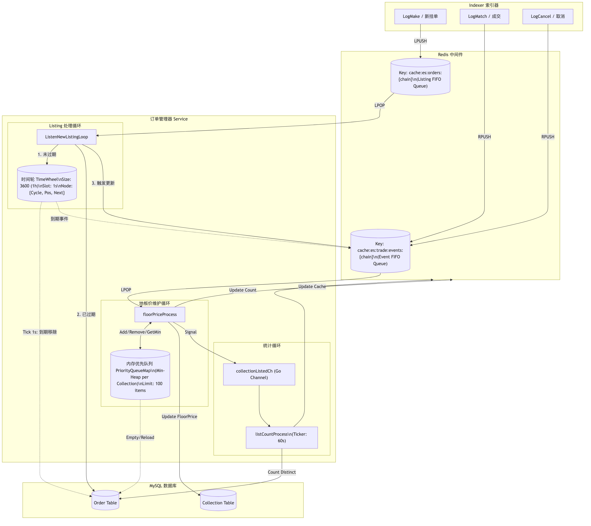

# EasySwapSync 队列机制分析

通过对 `EasySwapBase/ordermanager` 包的代码分析，EasySwapSync 项目主要使用了 Redis 队列和内部 Channel 来处理异步任务，核心目标是维护订单状态、计算集合地板价（Floor Price）以及统计上架数量。

以下是详细的队列架构分析：

## 1. 核心队列概览

项目主要包含两类 redis 队列和一类内存 Channel：

| 队列名称/类型 | Key 模式 | 生产者 | 消费者 | 任务描述 |
| :--- | :--- | :--- | :--- | :--- |
| **订单处理队列** | `cache:es:orders:%s` | 索引器 (Indexer) | `ListenNewListingLoop` | 处理新上架订单，检查过期时间，分发至过期检测队列和价格更新队列。 |
| **交易事件/地板价队列** | `cache:es:trade:events:%s` | 索引器 & 订单处理器 | `floorPriceProcess` | 处理 Listing/Cancel/Match 等事件，维护内存中的价格优先队列，实时计算并更新地板价。 |
| **统计更新通道** | `collectionListedCh` (Go Channel) | `floorPriceProcess` | `listCountProcess` | 信号通道，通知统计协程更新特定集合的 Listing 数量。 |

---

## 2. 详细处理流程

### 2.1 订单处理与过期机制 (Order Processing & Expiry)

**核心组件**: `ListenNewListingLoop` + 时间轮 (Time Wheel)

1.  **入队**: Indexer 监听到链上 `LogMake` 事件后，将订单信息 Push 到 Redis `cache:es:orders:{chain}`。
2.  **出队与分发 (`ListenNewListingLoop`)**:
    *   从 Redis 获取订单。
    *   **过期检查**:
        *   **已过期**: 更新 DB 状态为 `Expired`，发送事件触发地板价重新计算。
        *   **未过期**:
            1.  发送 `Listing` 事件触发地板价计算。
            2.  **加入时间轮**: 调用 `addToOrderExpiryCheckQueue` 进入内存延迟队列。

#### 时间轮 (Time Wheel) 详解
*   **结构**: 长度为 `WheelSize = 3600` 的环形数组，每个槽位是一个链表 (`NotifyActivities`)。
*   **精度**: **1秒** (1s per slot)。整个时间轮代表 **1小时** 的周期。
*   **节点结构 (`Order`)**:
    *   `CycleCount`: 剩余圈数 (例如过期时间在 2.5 小时后，则 CycleCount=2)。
    *   `WheelPosition`: 槽位索引 (index)。
    *   `Next`: 链表指针。
*   **处理逻辑 (`orderExpiryProcess`)**:
    *   **Ticker**:以此每 **1秒** 触发一次。
    *   **检查**: 遍历当前槽位 (`CurrentIndex`) 的链表。
    *   **判断**:
        *   若 `CycleCount == 0`: 订单到期！执行过期逻辑 (更新 DB, 触发地板价事件)，从链表移除。
        *   若 `CycleCount > 0`: `CycleCount--`，移动到下一轮扫描。
    *   **推进**: `CurrentIndex++` (超过 3600 则归零)。

### 2.2 地板价维护队列 (Floor Price Queue)
**核心组件**: `floorPriceProcess` + 内存优先队列 (`PriorityQueueMap`)

*   **入口**: `AddUpdatePriceEvent` (外部调用) 或内部转发。
*   **处理逻辑**:
    1.  **初始化**: 启动时加载 DB 中 `Active` 的订单，构建内存中的 `PriorityQueueMap` (每个集合一个最小堆)。
    2.  **事件循环**: 消费 Redis `cache:es:trade:events:{chain}`。
    3.  **事件处理**:
        *   **Listing**: 仅当价格 < 当前最高价 或 队列未满(100)时，加入内存堆。
        *   **Match/Buy**: 移除成交订单；**移除该 Maker 的所有同 Token 挂单**；从 DB 补充买家的其他有效挂单。
        *   **Cancel/Expired**: 从内存堆移除。
    4.  **计算**:
        *   调用 `GetMin()` 获取当前堆顶价格。
        *   若变动 -> 更新 `collection.floor_price` 字段及 Redis 缓存。
        *   **回源**: 若内存堆被清空，触发 `reloadCollectionOrders` 从 DB 重新加载最低价的 100 单。

### 2.3 统计更新流程 (List Count)
*   **触发**: 地板价处理逻辑中，若涉及特定集合变动，向 `collectionListedCh` 发送集合地址。
*   **聚合 (`listCountProcess`)**:
    *   使用 `map[string]bool` 在内存中去重记录待更新集合。
*   **执行**:
    *   **定时器 (60s)**: 每分钟执行一次 SQL `count(distinct token_id)`，更新 Redis `cache:es:{chain}:collection:listed:{addr}`。

---

## 3. 架构流程图

## 4. 总结
EasySwapSync 使用 **"Redis 缓冲 + 内存计算"** 的混合模式：
1.  **Redis 队列**: 确保 Indexer 和 Service 的解耦，防止流量突增压垮下游。
2.  **时间轮 (Time Wheel)**: 高效处理海量订单的精确过期（秒级），避免了轮询数据库的昂贵开销。
    *   **Tick**: 1s
    *   **Cycle**: 1h (3600 ticks)
3.  **内存优先队列**: 极大优化地板价计算。只有在"击穿"内存队列（最低价订单全部消耗完）时才访问数据库，保证了高频交易下的系统性能。
